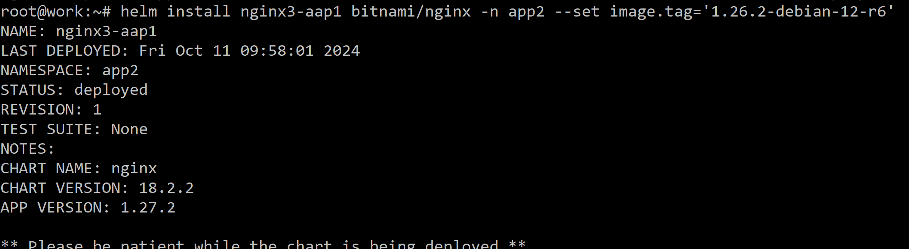

# Домашнее задание к занятию «Helm» - Илларионов Дмитрий

### Цель задания

В тестовой среде Kubernetes необходимо установить и обновить приложения с помощью Helm.

------

### Чеклист готовности к домашнему заданию

1. Установленное k8s-решение, например, MicroK8S.
2. Установленный локальный kubectl.
3. Установленный локальный Helm.
4. Редактор YAML-файлов с подключенным репозиторием GitHub.

------

### Инструменты и дополнительные материалы, которые пригодятся для выполнения задания

1. [Инструкция](https://helm.sh/docs/intro/install/) по установке Helm. [Helm completion](https://helm.sh/docs/helm/helm_completion/).

------

### Задание 1. Подготовить Helm-чарт для приложения

1. Необходимо упаковать приложение в чарт для деплоя в разные окружения. 
2. Каждый компонент приложения деплоится отдельным deployment’ом или statefulset’ом.
3. В переменных чарта измените образ приложения для изменения версии.

#### решение

Устанавливаю helm на рабочую ВМ (worker):

https://helm.sh/docs/intro/install/ 

```
curl https://baltocdn.com/helm/signing.asc | gpg --dearmor | sudo tee /usr/share/keyrings/helm.gpg > /dev/null
sudo apt-get install apt-transport-https --yes
echo "deb [arch=$(dpkg --print-architecture) signed-by=/usr/share/keyrings/helm.gpg] https://baltocdn.com/helm/stable/debian/ all main" | sudo tee /etc/apt/sources.list.d/helm-stable-debian.list
sudo apt-get update
sudo apt-get install helm
```


Все ок.

```
helm search repo bitnami
```


```
helm repo update
```
```
helm show chart bitnami/nginx
```


```
helm install bitnami/nginx --generate-name
```


```
helm uninstall nginx-1728626347
```


```
helm rollback nginx-1728626347
```


```
helm show values bitnami/nginx
```


Еще на свой рабочий ПК скачал чарты:

```
git clone https://github.com/bitnami/charts
```

Там нашел чарт nginx и смотрю его уже в VSC:


------
### Задание 2. Запустить две версии в разных неймспейсах

1. Подготовив чарт, необходимо его проверить. Запуститe несколько копий приложения.
2. Одну версию в namespace=app1, вторую версию в том же неймспейсе, третью версию в namespace=app2.
3. Продемонстрируйте результат.

Создал неймспейсы:


```
helm install nginx-aap1 bitnami/nginx -n app1 --set image.tag=1.26.2-debian-12-r6
```


```
helm install nginx2-aap1 bitnami/nginx -n app1 --set image.tag='1.26.2-debian-12-r6'
```


```
helm list -n app1
```


```
helm install nginx3-aap1 bitnami/nginx -n app2 --set image.tag='1.26.2-debian-12-r6'
```




### Правила приёма работы

1. Домашняя работа оформляется в своём Git репозитории в файле README.md. Выполненное домашнее задание пришлите ссылкой на .md-файл в вашем репозитории.
2. Файл README.md должен содержать скриншоты вывода необходимых команд `kubectl`, `helm`, а также скриншоты результатов.
3. Репозиторий должен содержать тексты манифестов или ссылки на них в файле README.md.

